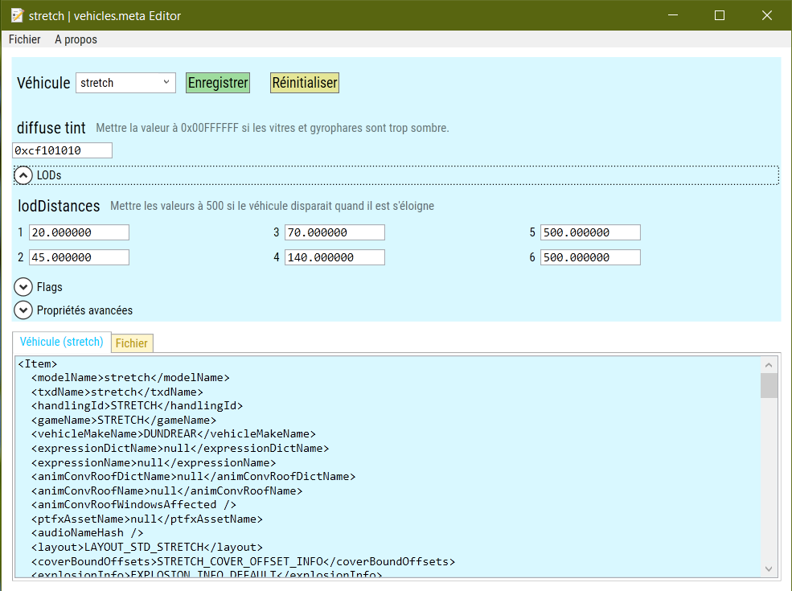
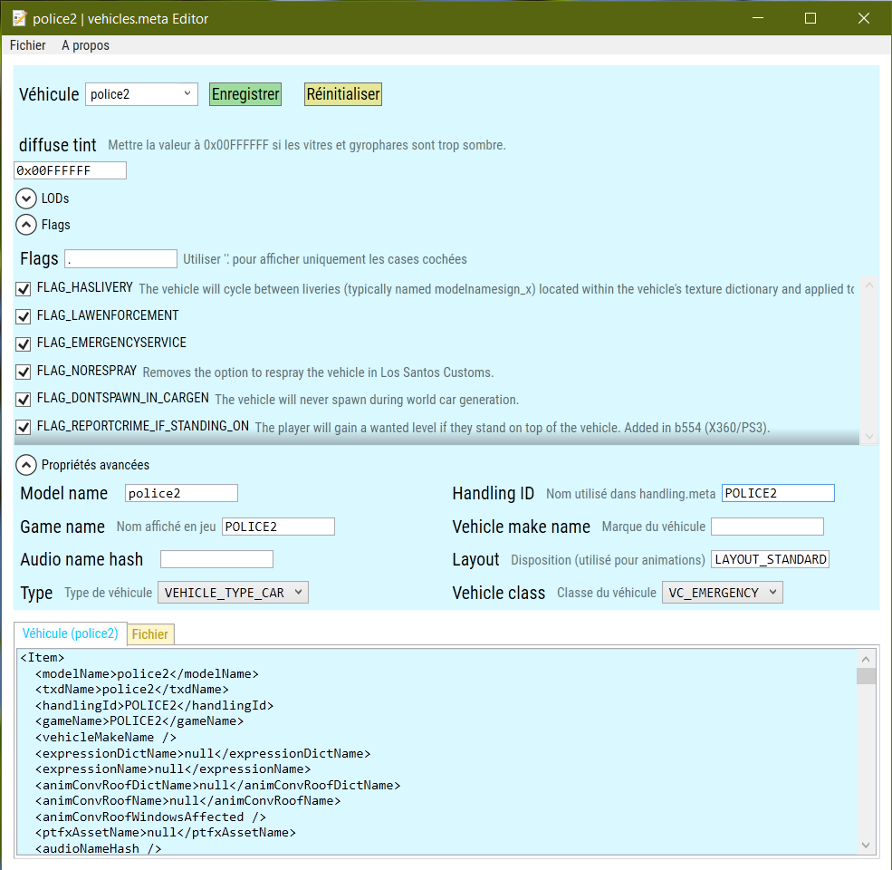

# VehiclesMetaEditor
Application WPF permettant d'éditer les valeurs des fichiers vehicles.meta _(pour modder le jeu GTA 5)_

## Exemple de valeurs pouvant être modifié :
- `diffuse tint` : vitres teintées
- `lodDistances` : distance à laquelle les différents LOD du véhicule doivent être utilisés
- `flags` : définissent certaines propriétés du véhicule

## Captures d'écrans

